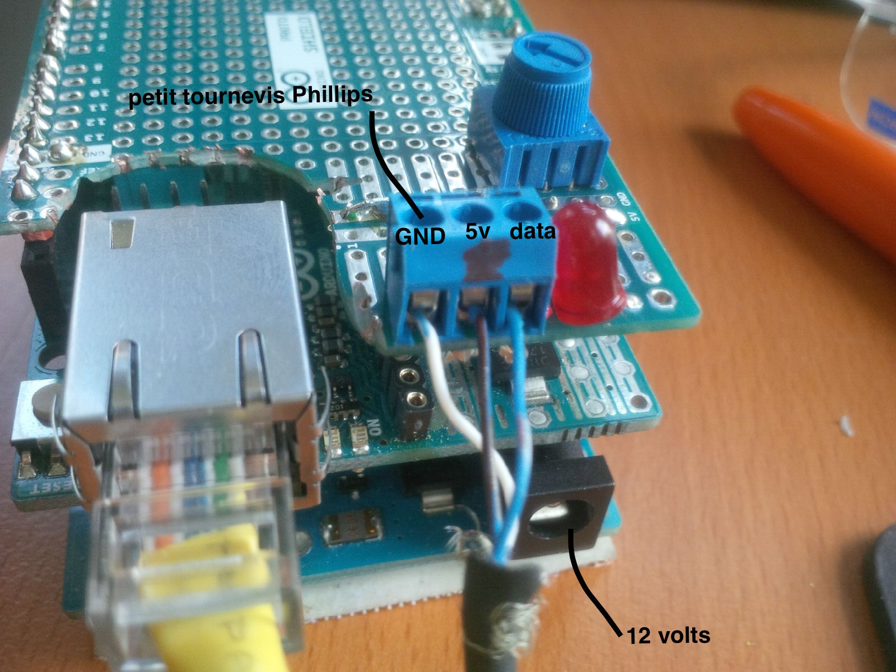
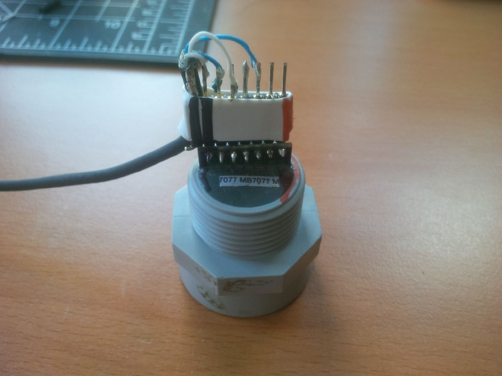

# arduino SonarOSC

## prérequis : 
* Requiert la version 1.7.10 d'arduino pour compiller
	* (ethernet2 et ethernetudp2)
* 1 arduino avec ethernet 
* 1 capteur ultrasonique
* 1 potentiomètre : "maximum range"
* 1 led status "quelque chose dans la zone"


## protocole

émet en OSC broadcast vers 192.168.1.255 port 10000:


```c++
/entree X D		// quand quelqu'un rentre dans la zone
/presence X D	// pendant que quelqu'un est dans la zone
/sortie X D		// quand pu personne n'est dans la zone
/maxDistance 	// donne la distanceMax quand on change la distance sur la résistance
```

où
X est le tag identifiant la présence (sur un compteur 8 bits qui cycle à 255)
D est la distance mesurée en mm (approx)


Pour changer l'adresse d'envoi ou le port, dans le code à la ligne 

```c++
//Arduino IP
IPAddress ip(192, 168, 1, 50);
//destination IP
IPAddress outIp(192, 168, 1, 255);
// port d'envoi
const unsigned int outPort = 10000;
```


## connections : 

prévoir un tournevis cruciforme.
* gnd = blanc
* 5v = bleu + marqueur
* data = bleu 



Aligner orange et noir du bon coté
il est normale que le header déborde de une unité du coté noir.


